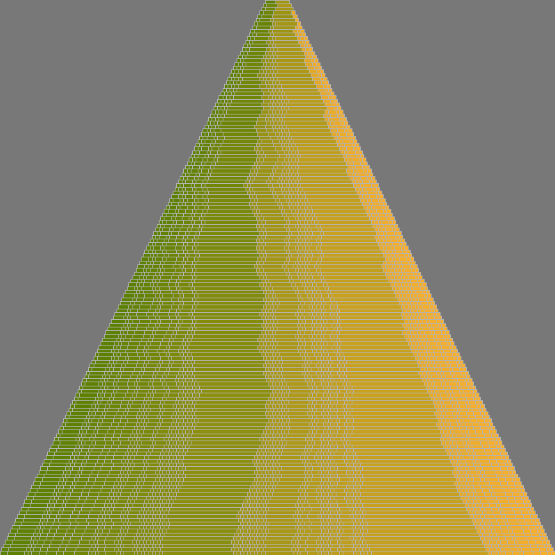

# Generations

## The final product
Colorful pyramids with randomly generated internal gradients.

## The generative bit
I simulated a Yule-style evolution on a set of "genuses." The process is as follows:  
1. Begin with an initial set of genuses, each having a particular size.
2. At each time step t = 1..n, select a genus from the set with probability proportional to the genus' size. *For example, consider the case with three genuses having populations of 1, 2, and 3. These genuses will have probability of being selected 1/6, 1/3, and 1/2 respectively.*
   1. For the selected genus, choose one of two options:  
      1. With some probability *p*, create a new genus with a single member. 
      2. Otherwise (with probability *1-p*), add a member to the selected genus.

## How it's drawn
Each horizontal level represents a time step in the process. Within each level is a series of rectangles, with size proportional to the population of that genus. The rectangles get a color based on their (arbitrary but consistent) index in the ordering of the genuses. This ordering comes from my choice to keep the genuses in a list and add the new offshoot genuses either before or after their 'parent' genuses.

Specifically, if a genus contains 30% of the global population at that stage and comes after 15% of the global population in the ordering scheme, then the rectangle will take up 30% of the width of the level and its color will be 15% of the way between the designated 'start' and 'stop' colors.